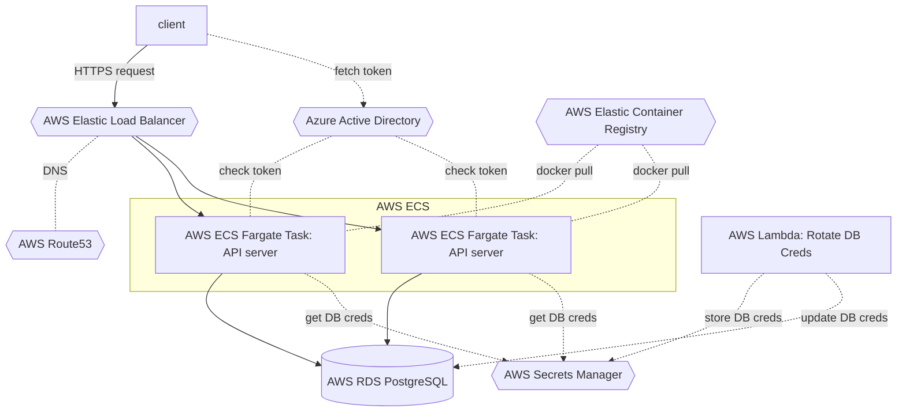

# TerraformCICD Cloud Architecture

```mermaid
flowchart TD
    client
    client -- HTTPS request --> load_balancer
    client -. fetch token .-> aad

    load_balancer{{AWS Elastic Load Balancer}}
    load_balancer -. DNS .- route53
    load_balancer --> ecs_task1
    load_balancer --> ecs_task2

    route53{{AWS Route53}}

    ecr{{AWS Elastic Container Registry}}
    ecr -. docker pull .- ecs_task1
    ecr -. docker pull .- ecs_task2


    aad{{Azure Active Directory}}
    aad -. check token .- ecs_task1
    aad -. check token .- ecs_task2

    subgraph ecs [AWS ECS]
        ecs_task1[AWS ECS Fargate Task: API server]
        ecs_task2[AWS ECS Fargate Task: API server]
    end

    ecs_task1 --> rds
    ecs_task2 --> rds

    rds[(AWS RDS PostgreSQL)]
    db_rotator[AWS Lambda: Rotate DB Creds]

    db_rotator -. store DB creds .-> secrets_manager
    db_rotator -. update DB creds .-> rds
    ecs_task1 -. get DB creds .-> secrets_manager
    ecs_task2 -. get DB creds .-> secrets_manager

    secrets_manager{{AWS Secrets Manager}}

    %% documentation links
    click route53 "https://aws.amazon.com/route53/"
    click load_balancer "https://aws.amazon.com/elasticloadbalancing/"
    click ecr "https://aws.amazon.com/ecr/"
    click aad "https://azure.microsoft.com/en-us/products/active-directory"
    click ecs_task1 "https://docs.aws.amazon.com/AmazonECS/latest/developerguide/AWS_Fargate.html"
    click ecs_task2 "https://docs.aws.amazon.com/AmazonECS/latest/developerguide/AWS_Fargate.html"
    click rds "https://aws.amazon.com/rds"
    click secrets_manager "https://aws.amazon.com/secrets-manager/"
    click db_rotator "https://aws.amazon.com/blogs/security/rotate-amazon-rds-database-credentials-automatically-with-aws-secrets-manager/"
```
