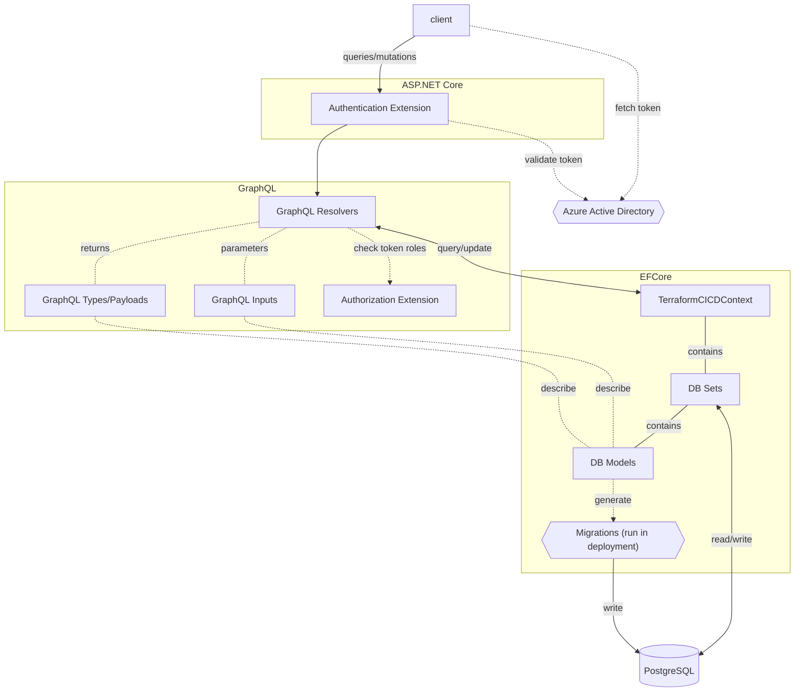

# TerraformCICD Code Architecture

```mermaid
flowchart TB
    client

    subgraph AspNet [ASP.NET Core]
        authn[Authentication Extension]
    end

    subgraph GraphQL
        resolver[GraphQL Resolvers]
        inputs[GraphQL Inputs]
        types[GraphQL Types/Payloads]
        authz[Authorization Extension]

        resolver -. parameters .- inputs
        resolver -. returns .- types
        resolver -. check token roles .-> authz
    end

    subgraph EFCore
        models[DB Models]
        context[TerraformCICDContext]
        dbset[DB Sets]
        migrations{{"Migrations (run in deployment)"}}

        dbset -- contains --- models
        context -- contains --- dbset
        models -. generate .-> migrations
    end

    database[(PostgreSQL)]
    aad{{Azure Active Directory}}

    client -- queries/mutations --> authn
    client -. fetch token .-> aad
    authn --> resolver
    authn -. validate token .-> aad
    inputs -. describe .- models
    types -. describe .- models
    dbset <-- read/write --> database
    resolver <-- query/update --> context
    migrations -- write ---> database

    %% documentation links
    click aad "https://azure.microsoft.com/en-us/products/active-directory"
```
